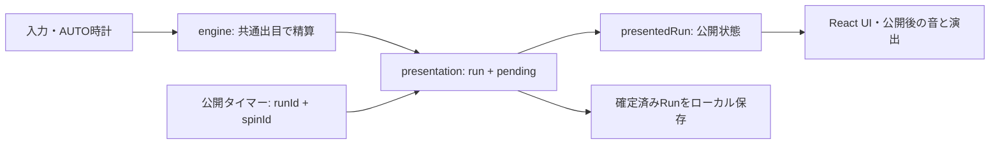

# Architecture

dontwork.fun 3.0.0の実装を読むための案内です。ローカル起動・forkの設定は[README](../README.md)、変更を送る際の確認事項は[CONTRIBUTING](../CONTRIBUTING.md)を参照してください。

ゲームの進行はブラウザが持つ`Run`で完結します。Reactが操作と時計を取りまとめ、ゲームエンジンが次の状態を計算し、presentation層が結果を画面へ公開します。Cloudflare Workers / D1はランキングや問い合わせなどの任意の接続先で、通常の抽選・精算・ローカル保存には必要ありません。

## ソース地図

ランキングの期間・平均、掲示板のD1保存・順位リンク・再送については [community.md](community.md) を参照してください。`RankingPeriod.tsx` と `server/rankingPeriod.js` が期間表示と日本時間の境界、`Board.tsx` / `boardDraft.ts` / `boardIdentity.ts` と `server/board.js` が掲示板を担当します。

| 入口・領域 | 主な責務 |
| --- | --- |
| [main.tsx](../src/main.tsx)、[BrandGate.tsx](../src/BrandGate.tsx) | 言語・PWAの初期化、旧ドメイン案内、未完了の旧移行処理の復元、ゲーム画面の起動。`?studio=1`は撮影用の別入口。 |
| [DesktopHost.tsx](../src/DesktopHost.tsx) | ゲームを所有する画面の選定、Web Locks、別ウィンドウへの引き継ぎ。 |
| [App.tsx](../src/App.tsx) | presentation reducer、入力、AUTO・30分の時計、自動保存、各UI・音・演出の接続。 |
| [game/engine.ts](../src/game/engine.ts) | `Run` / `Settings`、抽選・精算、WORK、強化、FLIP、クリア記録、セーブ検証・移行、30分ルール。 |
| [game/catalog.ts](../src/game/catalog.ts)、[game/odds.ts](../src/game/odds.ts)、[game/sweep.ts](../src/game/sweep.ts) | ギャンブルと比較用カタログ、現在の状態での確率・期待値、スイープ表示用の分布。 |
| [game/positionTutorial.ts](../src/game/positionTutorial.ts)、[game/guidance.ts](../src/game/guidance.ts) | 2番目のギャンブルへの入替進行と、公開状態に応じた次の操作案内。 |
| [presentation.ts](../src/presentation.ts)、[spinTiming.ts](../src/spinTiming.ts) | 確定済み結果の公開、演出中に使える資金、ギャンブル変更、AUTOと公開待ちのタイミング。 |
| [TradingViews.tsx](../src/TradingViews.tsx)、[SweepReadout.tsx](../src/SweepReadout.tsx)、[SpinProgress.tsx](../src/SpinProgress.tsx) | チャート・スイープ・進捗表示。フレームごとの表示には専用signalも使う。 |
| [Panels.tsx](../src/Panels.tsx)、[CoinFlip.tsx](../src/CoinFlip.tsx)、[TimeTrial.tsx](../src/TimeTrial.tsx)、[Leaderboard.tsx](../src/Leaderboard.tsx) | 設定・LAB・セーブ入出力、FLIP、30分UI、クリアカード・ランキング。 |
| [trialSaves.ts](../src/trialSaves.ts)、[rankingOutbox.ts](../src/rankingOutbox.ts)、[trialScores.ts](../src/trialScores.ts) | モード別保存と、通信が失敗しても残るランキング送信待ち。 |
| [backgroundPlay.ts](../src/backgroundPlay.ts)、[jackpotNotifications.ts](../src/jackpotNotifications.ts) | 離席中の計算・上限・チェックポイントと通知。 |
| [audio.ts](../src/audio.ts)、[music.ts](../src/music.ts)、[ResultVisuals.ts](../src/ResultVisuals.ts) | 音声出力、合成BGM、結果に応じたコイン・紙幣などの演出。 |
| [i18n.ts](../src/i18n.ts)、[locales/](../src/locales/)、[betNamePreferences.ts](../src/betNamePreferences.ts) | 日本語・英語の文言と、ギャンブル名の表示設定。[moneyPreferences.ts](../src/moneyPreferences.ts)は金額の省略・全桁表示。 |
| [serviceConfig.ts](../src/serviceConfig.ts)、[api.ts](../src/api.ts)、[server/](../server/) | オンライン機能の有効化、通信・計測、任意のWorker API。 |
| [pwaUpdates.ts](../src/pwaUpdates.ts)、[scripts/](../scripts/)、[drizzle/](../drizzle/) | PWA更新、ビルド後処理、DBの順序付きマイグレーション。 |

## 状態計算と画面への公開

### ゲームエンジン

[engine.ts](../src/game/engine.ts)の中心は`Run`を受け取り、次の`Run`を返す状態変換です。Reactの描画や音の完了は精算条件に含めません。`resolve`、`settlePortfolio`、確率・分布の計算を、UIとゲーム進行から共通で使います。

`spin`は1〜100の範囲から共通の出目を決め、全ギャンブルをその出目で精算します。ギャンブルごとに独立して抽選する仕組みではありません。ジャックポット中の低い出目の除外、出目加算、通常モードの序盤補助を適用し、賭け金・配当・追加損失・記憶・ジャックポット・履歴を更新します。`last`はその確定結果です。確率表示も同じルールを参照するため、新しいパターンでは勝敗だけでなく分布・期待値との整合も確認します。

「純粋な計算」と「環境との接点」は区別してください。エンジンは状態変換を中心にしていますが、全関数が厳密な純粋関数というわけではありません。ID・時刻・乱数の生成、初期言語・計測設定にはブラウザ環境への依存があります。テストでは`spin`の確定出目、`drawUpgrade`の乱数、30分・背景処理の`now`など、用意された引数や時計のモックで再現性を持たせます。

通常モードの入替チュートリアルは [positionTutorial.ts](../src/game/positionTutorial.ts) と [guidance.ts](../src/game/guidance.ts) が担当します。対象は `classic` / `billion` / `longgame` のクリックWORKで、2番目のギャンブル解放後に「外す→セット→AUTO」を案内します。`Run.secondBetTutorial` の `waiting` / `active` / `done` を保存し、表示段階は公開済みの編成から決めます。Jackpot中は入替案内を保留します。

BASELINEの序盤補助は標準 `WLWW`（当たり・ハズレ・当たり・当たり）の4回で終了します。旧5文字の標準 `WWLWW` は読込時に `WLWW` へ、独自のLAB順番は先頭4文字へ移行し、総スピン数や既存の記録は巻き戻しません。統計の入力は新4文字と旧5文字の両方を受け付けます。

入替案内と対象の初回当たり補助は標準ONです。独立したLAB設定 `secondBetAssist` でOFFにでき、その変更は比較用ランになります。受理済みの別ギャンブルの結果は変更せず、完了状態も結果公開まで隠します。途中のWORKによる公開ピーク到達を取りこぼしません。`secondBetAssistRevision: 1` がない通常の旧セーブは初回読込時に新しい標準ONへ移行し、LABランの選択は維持します。初回の消費状態・進行・ID・確定済みクリア記録は変えず、すでに対象を初めて回した後なら補助を再び与えません。チュートリアル状態自体がない古いセーブで既に対象を解放済みの場合も、再発動を防ぎます。移行後の明示的なOFFは再読込で保持されます。30分モードは引き続き対象外で、設定もOFFに正規化します。

### 一度だけ精算し、公開を遅らせる

[presentation.ts](../src/presentation.ts)は`{ run, pending }`を一つのreducerで管理します。スピンを受け付けた時点で`run`は精算後の状態になり、`pending.before`と`pending.after`に抽選前後を保持します。最初の描画から`presentedRun`を使うことで、演出開始前の一瞬に勝ち金やクリアが見えることも防ぎます。

`presentedRun`は未公開スピンの残高差分、履歴、出目、連勝、ジャックポット、クリア記録などを隠し、その間のWORK・購入・FLIPによる変更だけを公開状態に反映します。[App.tsx](../src/App.tsx)では確定状態を`s`、公開状態を`shown`として扱います。画面、次の確率表示、解放通知、結果音を追加するときは、どちらの状態を読むべきかを先に決めます。

演出の終了は`reveal`を送るだけで、抽選や配当をもう一度計算しません。`runId`と`spinId`を照合して、前のランのタイマーや二度目の公開を無視します。`settleAccepted`は保存・モード切替・30分終了などの境界で、受け付け済みの結果を演出なしで確定状態へまとめるための入口です。

[spinReveal.ts](../src/spinReveal.ts)が結果公開の期限を管理します。通常はタイマーで公開し、期限から250ms以上過ぎても公開待ちなら既存のゲームtickerから同じ結果を公開します。どちらも現在のラン・スピン・pending・30分モードの進行状態を照合し、先に期限を解除してから一度だけ通知します。0ms演出は同期公開のままです。復旧時は `client_error` の `spin-reveal-recovered` コードを記録します。非表示・ポーズ・モード切替・新規ラン・unmountでは、通常タイマーと復旧経路をまとめて取消します。抽選や資金計算は行いません。

ジャックポット中に次回の賭け金を払えなくなった場合は、残り回数を待機させず連鎖を終了します。スピンでは更新後の記憶から次回賭け金を求め、購入・FLIPなどではpresentationの非pending境界で判定します。受理済みスピンで終了した連鎖は、その後のWORKで復活しません。演出中に発生した終了は結果公開まで隠し、公開後に終了通知と通常の資金補充案内を出します。資金が賭け金ちょうどなら継続し、燃料不足やAUTO停止だけでは終了しません。`endUnfundedJackpot`は旧セーブの初期表示にも適用します。Jackpot終了イベントは `reason: funds` で区別します。[jackpotFunds.test.ts](../src/jackpotFunds.test.ts)

AUTOを停止しただけなら、ニュースは残り回数を保持して再開方法を優先表示し、`?` はスピン操作の説明に進みます。案内は公開済み状態から作ります。

演出中の操作には次の契約があります。

- **WORK:** 収入はすぐ表示します。残高の表示をスピン前へ固定して操作を失わせる実装にはしません。
- **購入:** `purchase`アクションで公開状態から解放・価格・抽選候補を評価し、購入による変更だけを確定状態へ移します。未公開のピーク残高や新しいジャックポットを購入条件に混ぜません。
- **FLIPと購入資金:** `coinBudget`が公開残高から未公開スピンの損失に備える金額を予約します。追加ペナルティも含めた分布を使うため、隠れている結果の勝敗によって使える額が変わらず、勝ち金の先取りや同じ資金の二重使用を防ぎます。`settled-change`経由のLAB操作は公開待ち中に拒否されます。
- **ギャンブル:** 受け付け済みスピンの結果と予約資金は保持し、編成変更は次回へ反映します。公開済みジャックポットを終わらせる編成変更には確認状態`positionRequest`があります。

## ローカル保存と記録

### 自動保存と移行

主セーブのキーは`bebullish-save-v1`です。名称は旧ブランド由来ですが、互換性のため現在も使用しています。[App.tsx](../src/App.tsx)は通常1秒ごと、ページ離脱、所有画面の終了などで保存します。保存時は受け付け済みスピンを含む`Run`をJSON化し、描画用の`pending`やタイマーは保存しません。保存に失敗した場合は書き出しを案内し、背景進行・PWA更新ではその失敗を停止条件にも使います。

[readSave](../src/game/engine.ts)は単なるJSON読み込みではなく、形式・金額・装備・設定・履歴・時計・確定記録を検証し、既定値の補完と旧設定の移行を行う入口です。通常はAUTOを停止して読み込み、検証済みの背景チェックポイントがある場合だけ、その再開経路を残します。古い形式の明示的な読み込みには`migrateLegacy`も使います。

バージョンには別々の役割があります。

| 値 | 現在値と役割 |
| --- | --- |
| `VERSION` / package version | `3.0.0`。リリース表示と記録のアプリバージョン。 |
| `Run.version` / 保存キー | `1`。保存形式の入口。アプリ更新ごとにキーを変えない。 |
| `ECONOMY_REVISION` | `13`。経済ルールと`astra-v13:…`などの比較条件。 |
| 設定内のrevision | 音・表示・背景設定などを一度だけ移行するための印。 |

経済revisionが異なるプレイ済みセーブは、進行を引き継ぎながら新しいランIDと`debug`扱いへ移します。確定済み`completion`は元のバージョン・IDを持つ独立した記録として検証します。既存の進行と、既に獲得した記録の比較条件を同じものとして上書きしないことが重要です。

[設定画面](../src/Panels.tsx)の書き出しは進行のJSON、読み込みは`readSave` / `migrateLegacy`を経由します。手動読み込みは比較用の扱いになるため、JSONを書き換えて読み直す開発手順と、通常の自動保存復元を混同しないでください。

### 通常モードと30分モード

[trialSaves.ts](../src/trialSaves.ts)は主セーブとは別に、`bebullish-normal-slot-v1`と`bebullish-30m-slot-v1`を持ちます。モード切替では受け付け済み・背景の結果を反映し、現在のモードを停止して退避してから、相手のスロットを復元するか新規作成します。退避を先に書くため、保存失敗で現在の進行を失わない構成です。

[trialUnlock.ts](../src/trialUnlock.ts)とAppが通常クリアから解放を記憶します。LABにも先行解放があります。通常プレイのセーブ・クリアカードは30分モードに置き換えられません。

解放済みのプレイヤーには、未開始のゲーム画面上に他方のモードへ切り替える案内を表示します。通常は最初のWORKなどの開始前、30分モードは砂時計を初めて押す前だけです。開始後の一時停止では再表示しません。案内は閉じられ、既存のモード別保存経路を使うため、他方の進行・ID・完了記録を上書きせず復元します。表示の判定とカードは [ModeSwitchNotice.tsx](../src/ModeSwitchNotice.tsx) にあります。

30分の状態は`Run.trial`です。`freshTrial`は通常の比較ルールを正規化し、序盤の出目・ジャックポット補助を無効にします。標準の`fixed`は30分固定で、LABの`shop` / `lottery`による延長はランキング対象外です。

3.0.0のスコアは`trialAssets = cash + spent`、つまり終了時の現金と強化への累計投資です。最高残高ではありません。過去の2.8 / 2.9の現金スコアは`-30m`、現在は`-30m-assets`というrulesetで分け、[trialScores.ts](../src/trialScores.ts)と[bankrollRankings.js](../server/bankrollRankings.js)の検索条件にも反映します。古い未完了チャレンジを現在の採点へ移す場合は比較用とし、古い確定結果の採点方式を維持します。

30分の左上は使える現金 `cash` を大きく表示し、その右、`30 MIN CHALLENGE` の左に「総資産」と `finiteMoney(cash + spent)` を表示します。強化購入は現金を減らして投資額へ移すため、現在の採点では総資産を減らしません。どちらも [BalanceReadout.tsx](../src/BalanceReadout.tsx) に渡す公開済みRunから計算し、未公開スピンの利益は両方から隠します。チャート・最終スコアの計算は同じままです。

### 不変のクリア記録とoutbox

通常モードの`finish`は、初めて目標残高に到達した時にだけ`completion`と`clearSnapshot`を作ります。その後のWORK・FLIP・継続プレイや設定変更で、当時の時間・回転数・資産・カード用統計を作り直しません。30分も締切で`trial.result`を一度作り、presentation層は終了後の進行変更を拒否しつつ、名前・送信状態・音などの設定変更を許可します。

結果の共有文と記念画像は、保存済み記録IDで取得した全体・版別順位も表示します。順位は結果画面で取得した時点のもので、クリア時の会計スナップショットは変更しません。[結果と順位の共有](RESULT-SHARING.md)を参照してください。

通常の[rankingOutbox.ts](../src/rankingOutbox.ts)と30分の[trialScores.ts](../src/trialScores.ts)は、名前と獲得記録をローカル保存してからネットワークへ送ります。送信待ちはそれぞれ`bebullish-ranking-outbox-v1`、`bebullish-30m-outbox-v1`に残り、起動・名前変更・再接続・30秒ごとの再試行で送信します。成功したIDのみ取り除き、通信失敗でクリア記録を消しません。

サーバーも`completion_id` / `score_id`の一意制約と`INSERT OR IGNORE`を使います。同じ記録の再送は重複登録せず、最初に保存した記録を置き換えません。通常クリアは時間の昇順、30分は終了資産の降順です。オンライン機能がOFFでもローカルの記録は残ります。

## 所有画面、背景進行、時計

[DesktopHost.tsx](../src/DesktopHost.tsx)はWeb Locksの`bebullish-active-game`を保持する画面だけに`App`をマウントします。待機画面は自動保存や音声ループを持ちません。別ウィンドウへの引き継ぎも、元画面のアンマウントによる保存・後始末を行ってから次の所有者へ渡します。Web Locks非対応環境では通常画面へフォールバックし、この排他機構と背景進行は利用できません。

時計は用途別です。

| 時計 | 用途 |
| --- | --- |
| `performance.now()`の差分 | 前景AUTOのチャージと演出公開待ち。50ms周期の処理で差分を最大200msに抑え、停止したタブの大量実行を避ける。 |
| `activeMs` | 通常クリアの実プレイ時間。前景でAUTOが回せる、または直近2分以内に入力がある間に加算する。許可された背景進行分も別経路で加算する。 |
| `trial.anchor`と`Date.now()` | 開始・再開後の30分締切。前景では空編成や資金不足でも、砂時計で開始中のチャレンジ時間は進む。一時停止はanchorを外す。 |
| `background`の保存時刻 | 非表示中や復帰時に、未処理の時間だけを順に精算するチェックポイント。 |

30分のreducerは表示の定期更新だけに頼らず、操作の受付時にも締切を確認します。締切までに受け付けた未公開結果を反映してから最終資産を固定し、締切ちょうどの追加WORK・FLIPなどは受け付けません。

[backgroundPlay.ts](../src/backgroundPlay.ts)の背景進行は通常モードのみで標準ONです。Web Locks、効果音ON・音量ありが必要で、通知APIの対応や許可とは独立しています。LABで背景進行をOFFにできます。ヘッダーのベルは任意のJackpot通知だけを設定し、明示的な通知ONボタンで許可を求めます。上限は1回の離席につき1時間・12,000スピンで、残り周期・演出待ちも計算に含めます。30分モードは設定・権限に関係なく背景進行から除外します。

復帰時は通常100ステップずつ処理し、**時計と残高を一つのlocalStorage値に保存してから**結果を画面・計測へ公開します。同じチェックポイントから再起動しても処理済み区間を再加算しません。保存できなければ進行を停止します。時計の巻き戻りや上限到達も停止条件です。

最初のジャックポットで通知設定に関係なく`backgroundJackpot`として時計とスピンを停止し、結果を保存して復帰を待ちます。音声許可は停止フラグとは分離し、到達音を完走させます。復帰時に前景で再開し、離席中の過去の音や派手な演出をまとめて再生しません。背景進行を使わない非表示遷移では、受け付け済み結果を反映し、30分を一時停止して保存します。これはサーバーで常時実行するジョブではなく、ブラウザの実行・通知制約を受ける処理です。

通常セーブの背景設定revision 3移行では標準ONへ変更し、古い時計checkpointを消します。既存の`backgroundJackpot`停止と確定記録は保持します。revision 3以降で明示的にOFFにした設定は再読込でも維持します。

30分モードは砂時計ボタンで開始・一時停止します。非表示・pagehideで時計を停止し、復帰時も手動再開を待ちます。旧セーブに背景チェックポイントがあっても、読込時に背景設定とチェックポイントを解除して一時停止し、離席分の時間・スピンを加算しません。確定済みの記録は保持します。

通常モードの `autoAlwaysOn` は既定ONです。通常ランキングの標準状態として扱い、LABでOFFにしたランは比較用になります。旧通常セーブは `autoAlwaysOnRevision: 1` のない最初の読込時だけONへ移行し、以後の明示的OFFと過去の比較用状態・確定済み記録は保持します。[automaticPlay.ts](../src/automaticPlay.ts) が前景・プレイ準備済み・資金と編成ありのときだけ再開し、保存失敗・背景Jackpot・プレビュー中の停止を尊重します。30分の作成・設定変更・読込では必ずOFFへ正規化します。

## 音と演出のライフサイクル

[audio.ts](../src/audio.ts)は最初のユーザー操作で音声を起こし、Web Audioの再開・中断からの復旧、発音数、待機中の短い音、ミュートを管理します。[audioPalette.ts](../src/audioPalette.ts) / [soundPresets.ts](../src/soundPresets.ts)は音色・設定、[resultSound.ts](../src/resultSound.ts)は確定結果から再生する音の選択を担当します。BGMは[music.ts](../src/music.ts)の独立したバスと発音数管理を持ち、結果音の余地を確保します。

現在のBGMは**標準OFF**で、選択肢は合成音のPulse / Night / Arcadeです。ジャックポット中だけONにする設定もあります。[fileAudio.ts](../src/fileAudio.ts) / [fileAudioPcm.ts](../src/fileAudioPcm.ts)には別の再生経路がありますが、`public/music/`にある旧録音4曲が現行BGMメニューに並ぶわけではありません。旧録音曲を選んだセーブはPulse・BGM OFFへ移行します。素材の再配布条件は[ASSETS](../ASSETS.md)と[音楽クレジット](../public/music/ATTRIBUTION.md)を参照してください。

結果の音・振動・画面効果は公開後に出します。[ResultVisuals.ts](../src/ResultVisuals.ts)、[WorkBurst.tsx](../src/WorkBurst.tsx)、[impact.ts](../src/impact.ts)、[feedback.ts](../src/feedback.ts)が各出力を担当し、[effectSequence.ts](../src/effectSequence.ts)は次の一段階だけを予約して、停止タブの演出が一気に追いつかないようにします。

非表示、ラン変更、モード切替、30分終了、関連設定の変更、アンマウントでは、対応するタイマー・音声ノード・アニメーション・振動を停止します。非同期コールバックもランIDや現在の可視状態を確認します。新しい演出には、開始処理と同時に取消処理を用意してください。`prefers-reduced-motion`とゲーム内の動きを抑える設定は[useReducedMotion.ts](../src/useReducedMotion.ts)経由で反映します。

曲別の計測は[docs/music-usage.md](music-usage.md)の定義に従い、同意済みの前景実プレイ時間で「再生要求」と「再生状態」を分けます。[soundExperiment.ts](../src/soundExperiment.ts)には過去の割付データを読む互換処理が残っていますが、現在の`initializeSoundExperiment`は新しいランダム割付を行いません。

## 翻訳と表示設定

[i18n.ts](../src/i18n.ts)の`t(日本語キー, ...値)`で文言を解決し、英訳を[locales/en.json](../src/locales/en.json)に置きます。`{0}`などの置換を使い、英訳がない場合は元のキーへフォールバックします。`useLanguage`は`useSyncExternalStore`で更新を購読し、選択を`dontwork-language`とHTMLの`lang`へ反映します。保存済み選択がなければ、端末の先頭言語が英語の時に英語、それ以外は日本語です。

ギャンブル名はUI言語とは別設定です。[betNamePreferences.ts](../src/betNamePreferences.ts)と[locales/bet-names-ja.json](../src/locales/bet-names-ja.json)を使い、英語名が標準、カタカナ・日本語名はLABで選びます。文言追加は両言語、金額・変数の置換、狭い幅、アクセシブルなラベルを合わせて確認します。

金額表記は [moneyPreferences.ts](../src/moneyPreferences.ts) が管理します。標準の省略表示と、桁区切り付きの全桁表示をLABで切り替え、`dontwork-money-style-v1`へ保存します。`Settings`やセーブJSONには含めず、ゲーム内の数値・計算・ランキング適格性は変更しません。`money()`がこの設定を参照し、常に省略表記が必要な箇所には`compactMoney()`を使えます。

[BalanceReadout.tsx](../src/BalanceReadout.tsx) は公開済みの`Run`と最新の資産変化だけを受け取り、見出しのない1段の資産欄を表示します。`Settings.balanceChangeInline`は標準OFFで、ONにすると資産・変化額・目標の順で隣接表示します。表示だけの設定として保存し、欠落した旧セーブにはOFFを補います。資産欄の高さを数字表記と分離し、浮いた縦幅をチャートへ戻します。

ニュース欄の高さは [release30.css](../src/release30.css) で統一しています。通常ニュース・チュートリアル・ジャックポットで共通の48px枠を予約し、上下2pxの余白を引いた44pxの表示枠を使います。desk・tab・撮影モード、上配置・下配置も同じ契約です。内容が変わってもチャートの位置や高さを変えません。長文は本文内でスクロールでき、ジャックポットの残り回数は説明文と分離して常に残します。説明ボタンも同じサイズです。

## 任意のWorker / D1とfork

[serviceConfig.ts](../src/serviceConfig.ts)が接続の境界です。通常のforkはオンラインサービス・新規プレイの計測設定ともにOFFです。自分の同一配信元のAPIを使うビルドでは`VITE_ENABLE_SERVICES=true`、計測の初期値を変更する場合は別に`VITE_ENABLE_TELEMETRY=true`を指定します。保存済みの計測選択は環境変数で上書きしません。localhost / 開発環境からの計測送信は[Telemetry](../src/api.ts)が抑止します。

公式ホストとテストモードには例外があり、ランキング用の共有接続先も[rankings.ts](../src/rankings.ts)経由で残っています。forkでは通常、共有接続先は空文字になり`/api/*`を自分の配信元へ送ります。サービスOFF時は`request`が送信前に失敗を返します。フォントなどの外部素材読み込みはこのスイッチとは別です。設定例・秘密情報の置き場所は[README](../README.md#forkとオンライン機能)を参照してください。

| API | 現在の役割 |
| --- | --- |
| `/api/rankings` | [rankings.js](../server/rankings.js)による通常クリア記録。 |
| `/api/bankroll-rankings` | [bankrollRankings.js](../server/bankrollRankings.js)による30分の記録と採点方式別の検索。 |
| `/api/telemetry` | [worker.js](../server/worker.js)による同意済み計測、検証・重複排除・集計。 |
| `/api/feedback`、`/api/ratings` | 問い合わせ・評価。計測の選択とは別の明示的な送信。 |
| `/api/leaderboard` | 以前のランキング方式に対応するAPI。現在のクリアカード送信は`/api/rankings`を使う。 |
| `/api/save-codes`、`/api/save-codes/restore` | 廃止済み。`410 Gone`を返す。 |

[worker.js](../server/worker.js)はAPI以外を`ASSETS`へ渡し、HTMLのルートに静的アプリを返します。D1は`DB` bindingです。Workerは受信データの形式・対応バージョン・ルールを検証して保存しますが、ゲーム全体をサーバー上で再実行して正当性を証明する設計ではありません。

## ビルド、PWA更新、DB更新

ホーム画面への追加案内は [Pwa.tsx](../src/Pwa.tsx) で共通化しています。iPhone/iPad（Safari・Chrome）は、共有→「表示を増やす」→ホーム画面に追加→アイコンから起動の4手順です。Androidはメニュー→インストール→アイコンから起動の3手順を維持します。

[package.json](../package.json)の`npm run build`はTypeScript検査、Viteビルド、[prepare-sites-build.mjs](../scripts/prepare-sites-build.mjs)を順に実行します。静的成果物は`dist/client/`、Worker用のコピーは`dist/server/`、SQLのコピーは`dist/.openai/drizzle/`です。スクリプト名にSitesが残っていますが、`dist/client/`は通常の静的ホスティングでも利用できます。現在のパス前提は`/`です。

[generate-pwa.mjs](../scripts/generate-pwa.mjs)はHTML・JS・CSS・対象素材・Service WorkerテンプレートからビルドIDを作り、HTMLと`sw.js`に埋め込みます。[service-worker.template.js](../scripts/service-worker.template.js)は一式の事前キャッシュが成功してから有効化します。API、POST、外部配信元はキャッシュ対象にしません。

PWA更新検出は`App`の外で動くため、所有権待ちの画面も新ビルドを検知できます。起動、前景復帰、再接続、5分ごとの確認で新ビルドを見つけても、Service Worker自身がゲームを強制再読込しません。[pwaUpdates.ts](../src/pwaUpdates.ts)とAppが、前景・公開待ちなし・購入操作なし・AUTO停止・安全なダイアログ状態を確認し、保存成功後に再読込します。同じビルドを繰り返し読まないためのsessionStorageの印も持ちます。

旧キャッシュは各ウィンドウが使用中のビルドを答えた後にだけ整理します。応答しない古い画面があれば保持し、使用中のJS/CSSを消さない方針です。`/play` / `play.html`には旧PWAのルート遷移不具合に対応した同一配信元の入口も残っています。

DB更新には[drizzle/](../drizzle/)の番号順SQLを適用します。[db/schema.ts](../db/schema.ts)はスキーマ定義の参照先ですが、`npm run build`はDBへSQLを適用しません。[worker.js](../server/worker.js)内に残る`CREATE_STATEMENTS`もリクエスト時の自動マイグレーションではありません。自分のローカルDB・公開DBそれぞれへREADMEの手順で適用します。

DB変更では、新しいSQLを追加し、APIが使う列・制約・インデックスとテスト用DBを合わせます。通常記録は[0006_clear_records.sql](../drizzle/0006_clear_records.sql)、評価は[0008_ratings.sql](../drizzle/0008_ratings.sql)、30分記録は[0009_bankroll_records.sql](../drizzle/0009_bankroll_records.sql)です。廃止した合言葉転送の[0007_save_codes.sql](../drizzle/0007_save_codes.sql)は移行履歴であり、現行機能の一覧ではありません。適用済みSQLの削除・書き換えで過去DBの履歴を変えないようにします。

## 変更箇所とテストの対応

[vite.config.ts](../vite.config.ts)のVitest設定は`src/`、`server/`、`scripts/`のテストを含みます。基本環境はNodeで、UIのHTML描画やブラウザAPIのモックも使います。実ブラウザの音声許可、PWAインストール、通知、画面幅の確認を全て代替するものではありません。

| 変更する契約 | 関連する既存テスト |
| --- | --- |
| 精算・価格・カタログ・旧セーブ | [engine.test.ts](../src/game/engine.test.ts)、[upgradeDraw.test.ts](../src/game/upgradeDraw.test.ts)、[game/内のreleaseテスト](../src/game/) |
| 入替案内・一度だけの初回当たり・復帰 | [positionTutorial.test.tsx](../src/positionTutorial.test.tsx)、[spinAssist.test.ts](../src/spinAssist.test.ts) |
| 全桁金額表示・資産欄の並び・表示設定の独立性 | [moneyPreferences.test.tsx](../src/moneyPreferences.test.tsx)、[BalanceReadout.test.tsx](../src/BalanceReadout.test.tsx) |
| 未公開結果、WORK・購入・FLIP、古いタイマー | [presentation.test.ts](../src/presentation.test.ts)、[coinFlip.test.tsx](../src/coinFlip.test.tsx)、[release30.test.tsx](../src/release30.test.tsx) |
| 30分の締切・一時停止・不変結果・モード保存と解放 | [timeTrial.test.ts](../src/timeTrial.test.ts)、[timeTrialUI.test.tsx](../src/timeTrialUI.test.tsx)、[release30.test.tsx](../src/release30.test.tsx)、[playerAccess.test.tsx](../src/playerAccess.test.tsx) |
| 排他所有・離席中の保存・時計の巻き戻り | [experience.test.tsx](../src/experience.test.tsx)、[backgroundPlay.test.ts](../src/backgroundPlay.test.ts)、[domainMigration.test.ts](../src/domainMigration.test.ts) |
| 音・演出の取消と抑制 | [audio.test.ts](../src/audio.test.ts)、[fileAudio.test.ts](../src/fileAudio.test.ts)、[effectSequence.test.ts](../src/effectSequence.test.ts)、[ResultVisuals.test.ts](../src/ResultVisuals.test.ts)、[WorkBurst.test.ts](../src/WorkBurst.test.ts) |
| 翻訳・標準設定・表示構造 | [render.test.tsx](../src/render.test.tsx)、[release30.test.tsx](../src/release30.test.tsx)、[compactDesk.test.tsx](../src/compactDesk.test.tsx) |
| 計測・Worker検証・ランキングの再送と採点 | [api.test.ts](../src/api.test.ts)、[worker.test.js](../server/worker.test.js)、[bankrollRankings.test.js](../server/bankrollRankings.test.js)、[timeTrial.test.ts](../src/timeTrial.test.ts) |
| PWA保存後更新、オフライン・旧画面のキャッシュ保持 | [pwaUpdates.test.ts](../src/pwaUpdates.test.ts)、[scripts/pwa.test.js](../scripts/pwa.test.js) |

Workerのテストは`node:sqlite`のメモリ内DBにマイグレーションを読み込みます。公開DBやCloudflareアカウントは不要です。関係するテストで境界条件を確認した後、PR前には`npm test`と`npm run build`を実行します。

## 互換コードを読むときの注意

`bebullish`という保存キー・通信メッセージ・キャッシュ名、[transferProtocol.ts](../src/transferProtocol.ts)、[domainMigration.ts](../src/domainMigration.ts)、古いAPI・録音素材は、既存データの復元や過去リリースへの対応のために残っています。現在の合言葉転送や旧ドメインからの自動転送を提供する意味ではありません。[BrandGate](../src/BrandGate.tsx)は中断済みのローカル移行journalを復元し、廃止した移行hashを除去したうえで旧ドメインを案内します。

同様に、現在の出目表示は数値です。旧`dice`設定は読み込み時に`number`へ移行します。新しい機能の説明やUIを追加するときは、保存互換用の名前や残存ファイルだけで判断せず、`main`からの現在の呼び出し、標準設定、公開メニュー、対応テストを合わせて確認してください。

### コンパクトな操作パネルとLABのコイン

標準deskのギャンブル・アップグレード・LABコインフリップは、同じ196pxの編集用トラックを使います。ギャンブルカードは中身の高さだけを使い、数量操作を左へ置きます。＋／−は44pxの操作領域を維持します。余った高さはスピンとチャートの両方へ配分し、タブ切替でこれらの高さを変えません。長いカードや強化一覧は枠内でスクロールできます。強化累計は全強化項目の後ろです。撮影モードとLABの旧タブ式は別のレイアウトを維持します。[release30.css](../src/release30.css)

コインフリップの入口には `settings.coinFlip`（既定OFF）を追加しています。`coinUnlocked` がこの設定と公開済みの最高資産 `$10K超` を判定するため、通常画面の切替・解放通知・FLIP操作を一括で制御します。`coinEnabled` はWORKをFLIPへ切り替えたかどうかの別状態です。OFFにするとWORKへ戻りますが、過去のコイン収支、未合流のチャート情報、クリア記録は維持します。旧セーブの設定欠落もOFFで補完し、30分の新規開始ではOFFへ標準化します。公平なコインの配当や既存のランキング適格性は変更していません。[coinFlip.test.tsx](../src/coinFlip.test.tsx)

## 通常WORKの受付

[src/workInput.ts](../src/workInput.ts)がUI入力の直近1秒を`performance.now()`で管理します。通常WORKとLABの手遊びが同じ受付を使い、設定変更やタブ切替では枠を補充しません。許可した入力だけ既存の`work`をdispatchし、結果待ちのスピンとは従来のpresentation合流を使います。設定は`workClicksPerSecond`（既定15、1〜60）で保存・統計へ反映します。30分モードにはこの速度制限を適用せず、エンジンの計算用`work`にもUI時計を持たせません。[テスト](../src/workInput.test.tsx)。

問い合わせ管理APIの`/api/analytics/inquiries`は既存funnelと同じ`ANALYTICS_READ_TOKEN`で保護されたGETです。公開クライアントに問い合わせ本文や連絡先は含めず、認証済み管理ツールだけが最新一覧を取得します。DB変更はありません。
